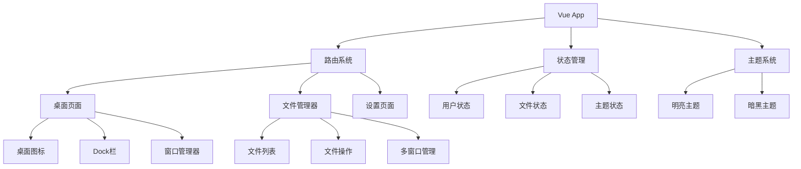

## 产品概述

iPadOS-Windows-UI-Redesign 是一个融合iPadOS美学风格与Windows文件管理功能的前端界面重设计项目。该设计将现代操作系统的最佳特性结合，提供直观、美观且功能强大的用户体验。

## 核心功能

- **iPadOS视觉设计**：采用圆角、毛玻璃效果、现代动画和手势交互，打造精美的视觉体验
- **Windows多窗口文件管理**：支持多窗口操作、文件拖拽、右键菜单和任务栏管理
- **开源UI组件库导航**：集成现代化UI组件库，提供统一的导航和交互体验
- **AI助手悬浮按钮**：智能助手悬浮按钮，提供上下文相关的帮助和快捷操作
- **暗黑/明亮主题切换**：完整的主题切换系统，支持自动和手动模式
- **与后端API完全兼容**：保持与现有Django后端API的完全兼容性

## 技术栈

- **前端框架**：Vue 3 + TypeScript + Vite
- **UI组件库**：Element Plus (企业级组件库，支持暗黑主题)
- **图标库**：FontAwesome 6
- **状态管理**：Pinia
- **HTTP客户端**：Axios
- **样式方案**：CSS3 + 现代CSS特性 (backdrop-filter, CSS Grid, Flexbox)

## 系统架构

### 整体架构模式

采用基于组件的单页面应用(SPA)架构，结合Vue 3的Composition API进行模块化开发。



### 模块划分

- **UI组件模块**：可复用的基础组件和业务组件
- **窗口管理模块**：多窗口创建、拖拽、最小化、最大化功能
- **文件管理模块**：文件浏览、上传、下载、重命名等操作
- **主题管理模块**：主题切换、颜色系统管理
- **AI助手模块**：智能悬浮按钮和上下文帮助
- **API集成模块**：与Django后端的数据交互

### 数据流

用户交互 → Vue组件状态更新 → API调用 → 后端响应 → 界面更新

## 实现细节

### 目录结构优化

```
frontend/
├── src/
│   ├── components/
│   │   ├── ui/           # 基础UI组件
│   │   ├── windows/      # 窗口组件
│   │   └── dock/         # Dock栏组件
│   ├── views/
│   │   ├── Desktop.vue   # 桌面视图
│   │   ├── FileManager.vue # 文件管理器
│   │   └── Settings.vue  # 设置页面
│   ├── stores/
│   │   ├── theme.ts      # 主题状态管理
│   │   ├── windows.ts    # 窗口状态管理
│   │   └── files.ts      # 文件状态管理
│   ├── services/
│   │   ├── api.ts        # API服务
│   │   └── theme.ts      # 主题服务
│   ├── utils/
│   │   ├── window.ts     # 窗口工具函数
│   │   └── theme.ts      # 主题工具函数
│   └── types/
│       └── index.ts      # TypeScript类型定义
```

### 关键技术实现

1. **窗口系统**：基于Vue 3的动态组件和Teleport实现多窗口管理
2. **主题切换**：CSS变量和动态类名切换实现主题无缝切换
3. **毛玻璃效果**：使用backdrop-filter和CSS渐变实现现代视觉效果
4. **文件拖拽**：HTML5 Drag and Drop API配合自定义事件处理
5. **响应式设计**：CSS Grid和Flexbox实现自适应布局

### 集成方案

- **API集成**：保持现有API接口不变，优化数据格式处理
- **组件库集成**：Element Plus提供企业级组件基础
- **动画系统**：Vue Transition和CSS动画实现流畅交互

## 设计风格

采用融合iPadOS美学与Windows功能性的混合设计风格。整体设计强调现代化、直观性和功能性，结合毛玻璃效果、圆角设计和流畅动画，创造既美观又实用的操作系统界面体验。

### 页面规划

1. **桌面主界面**：iPadOS风格的桌面，包含图标网格、动态壁纸和Dock栏
2. **文件管理器**：Windows风格的多窗口文件浏览器，支持标签页和侧边栏
3. **设置中心**：统一的设置界面，包含主题切换和个性化选项
4. **AI助手面板**：智能悬浮助手，提供上下文帮助和快捷操作

### 页面块设计

**桌面主界面**

- 顶部状态栏：系统时间、网络状态、用户信息
- 桌面图标网格：iPadOS风格的应用图标布局
- Dock栏：macOS风格的应用程序启动器
- 背景壁纸：动态壁纸系统，支持主题同步

**文件管理器**

- 窗口标题栏：Windows风格的控制按钮（最小化、最大化、关闭）
- 侧边栏导航：快速访问常用文件夹和收藏夹
- 文件列表区域：网格和列表视图切换
- 状态栏：文件统计信息和操作反馈

**AI助手悬浮按钮**

- 圆形悬浮按钮：始终可见的智能助手入口
- 上下文菜单：基于当前操作的智能建议
- 聊天界面：与AI助手的交互对话窗口